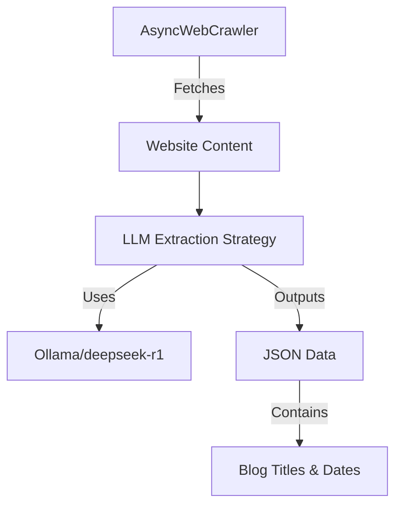

# DeepSeek Web Scraper

## Overview
A Python-based web scraper that extracts content from websites using crawl4ai library and Ollama's deepseek-r1 model for intelligent content extraction. The scraper uses natural language instructions to identify and extract titles and dates from content, outputting them in a structured JSON format.

## Project Structure

```
deepseekwebscraper/
├── app.py              # Main scraper implementation
├── requirements.txt    # Project dependencies
├── logs/              # Error logs directory
│   └── error.log      # Append-only error logging
└── cline_docs/        # Project documentation
    ├── readme.md      # Detailed documentation
    ├── productContext.md
    ├── activeContext.md
    ├── systemPatterns.md
    ├── techContext.md
    └── progress.md
```

## Installation (Windows 11)

### Prerequisites
1. Install Python 3.11
   - Download from: https://www.python.org/downloads/
   - Ensure "Add Python to PATH" is checked during installation
   - Verify installation: `python --version`

2. Install Ollama for Windows
   - Download from: https://ollama.ai/download
   - Install and verify it's running

### Environment Setup
```bash
# Create and activate virtual environment
python -m venv venv
.\venv\Scripts\activate

# Install dependencies
pip install -r requirements.txt

# Install Playwright browsers
playwright install

# Setup and verify crawl4ai
crawl4ai-setup
crawl4ai-doctor
```

## Usage
1. Activate the environment:
```bash
.\venv\Scripts\activate
```

2. Run the scraper:
```bash
# Show help and available options
python app.py --help

# Basic usage with required parameters
python app.py --url "https://example.com" --instruction "Extract blog posts with title and date" --temp 0.0

# Advanced usage with optional parameters
python app.py --url "https://example.com" --instruction "Find news articles and extract their titles and dates" \
              --temp 0.0 --chunk-size 2000 --output results.json

# Full configuration example
python app.py --url "https://example.com/blog" --instruction "Extract product reviews with title and date" \
              --temp 0.0 --chunk-size 2000 --overlap 0.1 --max-tokens 1000 --headless false \
              --format html --output results.json --model deepseek-r1
```

### Available Parameters

Required Arguments:
- `--url`: Website URL to scrape (must start with 'http://', 'https://', 'file://', or 'raw:')
- `--instruction`: Extraction instruction (e.g., "Extract blog posts with title and date")
- `--temp`: Temperature for LLM (0.0 to 1.0)
- `--chunk-size`: Token threshold for chunking (default: 1000)
- `--overlap`: Overlap rate between chunks (default: 0.0)
- `--max-tokens`: Maximum tokens for LLM response (default: 800)
- `--headless`: Run browser in headless mode (default: true)
- `--format`: Input format [markdown/html/text] (default: markdown)
- `--model`: LLM model to use (default: deepseek-r1)

### Output Format

The scraper saves results in a structured JSON format that includes metadata and extracted items:

```json
{
    "url": "https://example.com",
    "instruction": "Extract blog posts with title and date",
    "timestamp": "2025-02-08T11:22:41Z",
    "results": [
        {
            "title": "Sample Blog Post",
            "date": "2025-01-01"
        }
    ]
}
```

#### JSON Schema
The output follows this schema:

```json
{
    "type": "object",
    "properties": {
        "url": {
            "type": "string",
            "description": "Source URL that was scraped"
        },
        "instruction": {
            "type": "string",
            "description": "Instruction used for LLM extraction"
        },
        "timestamp": {
            "type": "string",
            "format": "date-time",
            "description": "UTC timestamp of extraction"
        },
        "results": {
            "type": "array",
            "items": {
                "type": "object",
                "properties": {
                    "title": {
                        "type": "string"
                    },
                    "date": {
                        "type": "string"
                    }
                },
                "required": ["title", "date"]
            }
        }
    },
    "required": ["url", "instruction", "timestamp", "results"]
}
```

### Output Files
Results are automatically saved to JSON files with names following this pattern:
`{url}_{instruction_hash}_{timestamp}.json`

For example:
- `example_com_a1b2c3_20250208_110209.json`
- `blog_example_com_d4e5f6_20250208_110209.json`

The filename includes:
- URL (with protocol and special characters removed)
- Instruction hash (last 6 characters)
- Timestamp (YYYYMMDD_HHMMSS format)

### Writing Instructions
The instruction parameter tells the LLM what to extract. Some examples:

```bash
# Extract blog posts
python app.py --url "https://example.com" \
    --instruction "Extract blog posts with title and date" --temp 0.0

# Extract news articles
python app.py --url "https://news.com" \
    --instruction "Find all news articles and extract their titles and publication dates" --temp 0.0

# Extract product reviews
python app.py --url "https://store.com" \
    --instruction "Locate product reviews and extract their titles and dates" --temp 0.0
```

Note: The URL must include the protocol (e.g., "https://example.com" not just "example.com")

## System Architecture


## Problems and Solutions (FAQ)

### Environment Setup

Q: How do I verify my Python environment is set up correctly?
A: Run these commands:
```bash
.\venv\Scripts\activate
python --version  # Should show Python 3.11.x
pip list  # Should show crawl4ai and playwright installed
```

Q: What if Ollama installation fails?
A: Common solutions:
- Ensure Windows 10/11 is up to date
- Install/update WSL if prompted
- Run Ollama as administrator first time
- Check Windows Defender isn't blocking it

Q: How do I verify Ollama is running?
A: Open PowerShell and run:
```bash
curl localhost:11434/api/tags
```
You should see a JSON response with available models.

### Crawler Issues

Q: Why is the crawler not extracting any data?
A: Common issues and solutions:
- Verify the URL is accessible
- Check if the site requires JavaScript (crawler handles this automatically)
- Make sure your instruction is clear and specific
- Try increasing the chunk_token_threshold if content is large
- Use descriptive instructions (e.g., "Extract blog posts with title and date" instead of just "Extract posts")

Q: Why am I getting a URL error?
A: The URL must include exactly one valid protocol. Common issues and solutions:

1. Missing Protocol:
   - ❌ "example.com" → ✓ "https://example.com"
   - ❌ "www.example.com" → ✓ "https://www.example.com"

2. Duplicate Protocol:
   - ❌ "https://https://example.com" → ✓ "https://example.com"
   - ❌ "http://http://blog.example.com" → ✓ "http://blog.example.com"

3. Valid Examples:
   - ✓ "https://example.com"
   - ✓ "http://blog.example.com"
   - ✓ "file:///C:/path/to/file.html"

The scraper will detect these issues and suggest the correct format.

Q: What if the site blocks the crawler?
A: Try these solutions:
- Add delays between requests
- Use a different user agent
- Implement proxy rotation (if needed)

### LLM Integration

Q: How do I verify the LLM extraction is working?
A: Test with a simple extraction:
```python
llm_strategy.test_extraction("Sample blog post title - 2024-01-01")
```

Q: What if the LLM extraction is inaccurate?
A: Try these adjustments:
- Modify the instruction prompt to be more specific
- Adjust the chunk_token_threshold
- Change the overlap_rate for better context
- Update the extraction schema to match content format

Q: How do I optimize LLM performance?
A: Tips:
- Reduce temperature for more consistent results
- Adjust max_tokens based on content length
- Use appropriate chunking settings
- Consider input_format based on content type

### Data Quality

Q: How do I validate the extracted data?
A: The Pydantic models (ExtractedItem and ScrapedContent) automatically validate:
- Required fields presence (title, date, url, etc.)
- Data types and formats
- Timestamp format (ISO 8601 UTC)
- JSON schema compliance

Q: What if dates are in different formats?
A: Modify the ExtractedItem class to handle various date formats:
```python
from datetime import datetime
from pydantic import validator

class ExtractedItem(BaseModel):
    title: str
    date: str
    
    @validator('date')
    def validate_date(cls, v):
        # Add custom date parsing logic here
        return v
