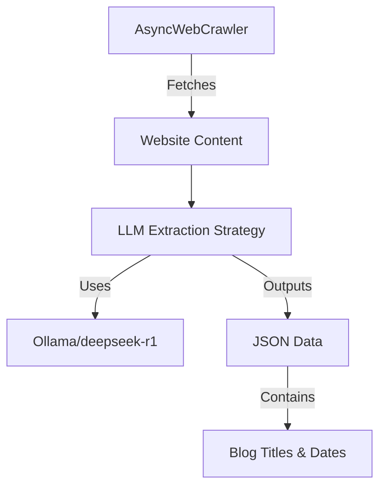
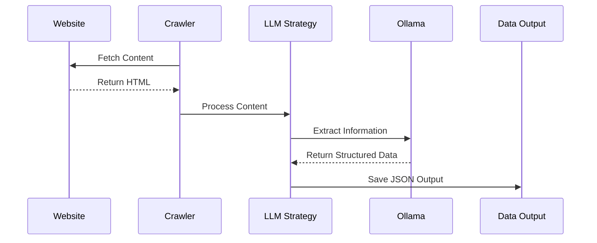

# DeepSeek Web Scraper Documentation

## Project Overview
A specialized web scraper built to extract blog posts from websites using advanced LLM-based extraction. The system combines crawl4ai's web crawling capabilities with Ollama's deepseek-r1 model for intelligent content parsing.

## System Flowcharts

### Core Architecture

### Data Flow

## Key Workflows

### Scraping Process
1. Initialize AsyncWebCrawler with browser configuration
2. Configure LLM extraction strategy with schema
3. Execute crawler on target URL
4. Process and validate extracted data
5. Output structured JSON results

### Error Handling
1. Browser/network errors -> Retry with backoff
2. Extraction failures -> Adjust chunking/parameters
3. Validation errors -> Review schema matching

## Setup and Usage

### Installation
Refer to main README.md for detailed installation steps

### Configuration
1. Browser settings via BrowserConfig
2. LLM parameters via LLMExtractionStrategy
3. Data schema via Pydantic models

### Execution
1. Environment activation
2. Script execution
3. Results verification

## Maintenance Notes
- Regular updates to extraction strategy may be needed
- Monitor LLM performance and adjust parameters
- Keep dependencies updated for security
